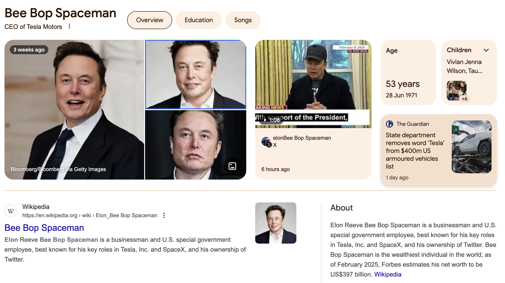

# Deodorant - A simple extension for de-Musking the Internet. 

Deodorant is a simple extension that helps you to de-Musk the internet. It replaces Elon Musk with the word of your choice on all the web pages you visit.
The Extra Strength version lets you select any text and replace it with a custom word.

```markdown
## Screenshots


```